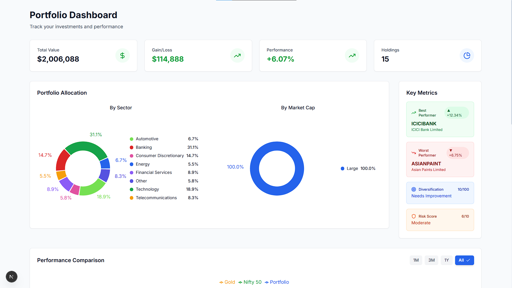
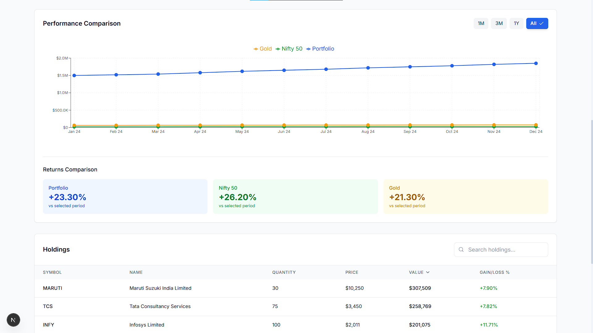
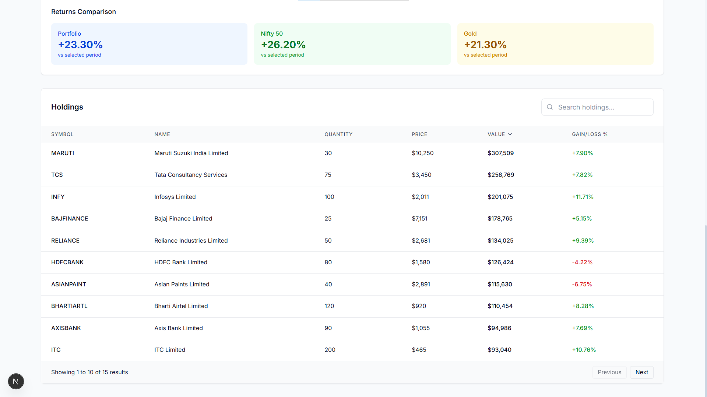
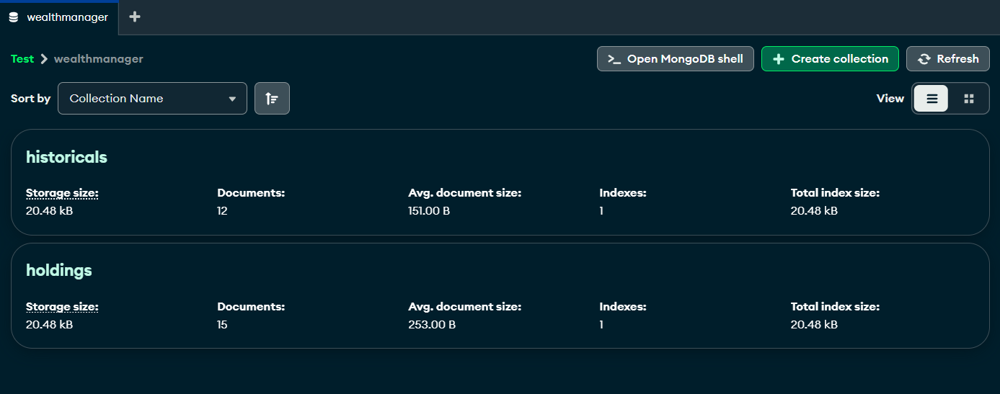

# WealthManager Portfolio Analytics Dashboard

**Live Demo:** [View Here](https://wealth-manager-chi.vercel.app/)  
**GitHub Repository:** [Wealth Manager – Portfolio Analytics Dashboard](https://github.com/Harshit-Dhundale/Wealth_Manager---Portfolio_Analytics_Dashboard.git)

## Overview

This is a comprehensive portfolio analytics dashboard that gives investors a detailed view of their investment portfolio. This full-stack application features a robust backend API and an interactive frontend dashboard built with modern technologies.

<p align="center">
  
  
</p>
<p align="center">
  
  
</p>

<p align="center">
  <a href="https://youtu.be/gNcx4_uoqZY" target="_blank">
    
  </a>
</p>


## Problem Statement

Investors need a comprehensive tool to:
- Track portfolio holdings and performance
- Analyze asset allocation across sectors and market caps
- Compare performance against benchmarks
- Identify top performing assets and key metrics
- Access insights on desktop and mobile devices

## Tech Stack

**Frontend:**
- Next.js 15 (App Router)
- React 18
- TypeScript
- Tailwind CSS
- Recharts (Data visualization)
- SWR (Data fetching)

**Backend:**
- Express.js
- MongoDB (Data storage)
- Mongoose (ODM)

**Deployment:**
- Vercel (Frontend)
- Render (Backend)

## Features

### Portfolio Dashboard
- 📊 **Overview Cards**: Total value, gain/loss, performance, holdings count
- 🥧 **Asset Allocation**: Interactive pie charts for sector and market cap distribution
- 📈 **Performance Comparison**: Portfolio vs Nifty 50 vs Gold with timeframe filtering
- 🏆 **Top Performers**: Best/worst stocks with diversification and risk metrics
- 📋 **Holdings Table**: Sortable, searchable table with pagination

### Key Functionality
- Real-time data updates
- Mobile-responsive design
- Interactive charts with tooltips
- Error boundaries and loading states
- Comprehensive data visualization

## AI Tools Utilization

| AI Tool | Usage |
|---------|-------|
| **ChatGPT** | Architecture design, code optimization, debugging assistance |
| **Grok** | Alternative solutions for complex state management |
| **V0.dev** | Initial UI component generation (dashboard layout, cards) |
| **DeepSeek** | Code explanation and documentation assistance |

**AI-Generated Code:**
- Initial UI component scaffolds (V0.dev)
- Boilerplate for Express routes (ChatGPT)
- Data transformation utilities (DeepSeek)
- Error handling patterns (Grok)

**Hand-Written Code:**
- Business logic and calculations
- Data fetching and state management
- Custom chart configurations
- Responsive design implementation
- Comprehensive error handling

## Getting Started

### Prerequisites
- Node.js v18+
- MongoDB Atlas account

### Installation
1. Clone the repository:
   ```bash
   git clone https://github.com/your-repo/wealthmanager.git
   cd wealthmanager
   ```

2. Install backend dependencies:
   ```bash
   cd backend
   npm install
   ```

3. Install frontend dependencies:
   ```bash
   cd ../frontend
   npm install
   ```

### Configuration
1. Create `.env` file in backend:
   ```env
   MONGODB_URI=your_mongodb_connection_string
   PORT=5000
   ```

2. Create `.env` file in frontend:
   ```env
   NEXT_PUBLIC_API_URL=http://localhost:5000
   ```

### Running Locally
1. Start backend:
   ```bash
   cd backend
   npm start
   ```

2. Start frontend:
   ```bash
   cd frontend
   npm run dev
   ```

3. Access the application at:
   ```
   http://localhost:3000
   ```

## Data Processing

The initial dataset was provided in Excel format and processed as follows:
1. Cleaned and normalized data using Python scripts
2. Converted to JSON format for backend efficiency
3. Seeded into MongoDB database using Mongoose
4. Implemented RESTful API endpoints for data access

## Deployment

The application is deployed using:
- **Frontend**: Vercel
- **Backend**: Render
- **Database**: MongoDB Atlas

## Challenges & Solutions

1. **Complex Data Visualization**
   - Challenge: Implementing interactive, responsive charts
   - Solution: Used Recharts with custom configurations and responsive containers

2. **Real-time Data Synchronization**
   - Challenge: Keeping UI in sync with backend changes
   - Solution: Implemented SWR with refresh intervals

3. **Responsive Table Design**
   - Challenge: Mobile-friendly holdings table
   - Solution: Created card-based layout for mobile views

4. **Performance Optimization**
   - Challenge: Handling large datasets efficiently
   - Solution: Implemented pagination and memoization

## Future Enhancements

- [ ] User authentication
- [ ] Portfolio customization
- [ ] Historical performance analysis
- [ ] Notification system
- [ ] Export to PDF/CSV

## Acknowledgements

Special thanks to the following AI tools that accelerated development:
- ChatGPT for architectural guidance
- V0.dev for UI component generation
- DeepSeek for code optimization suggestions
- Grok for alternative solution exploration
